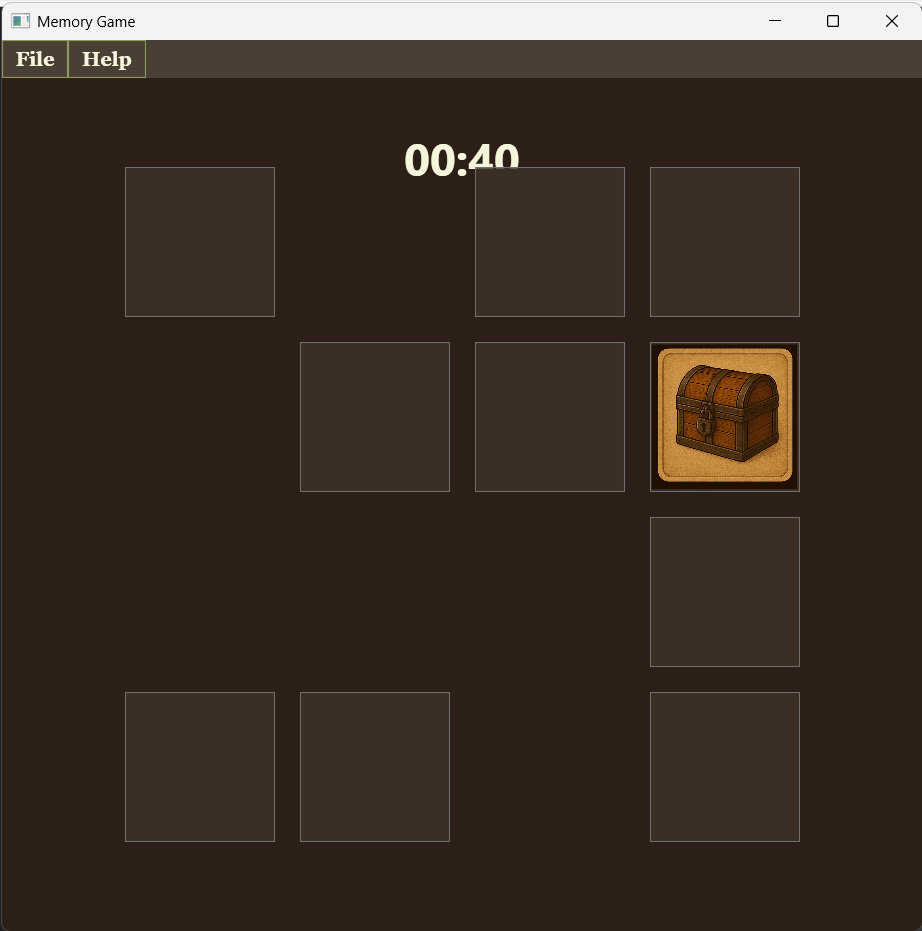
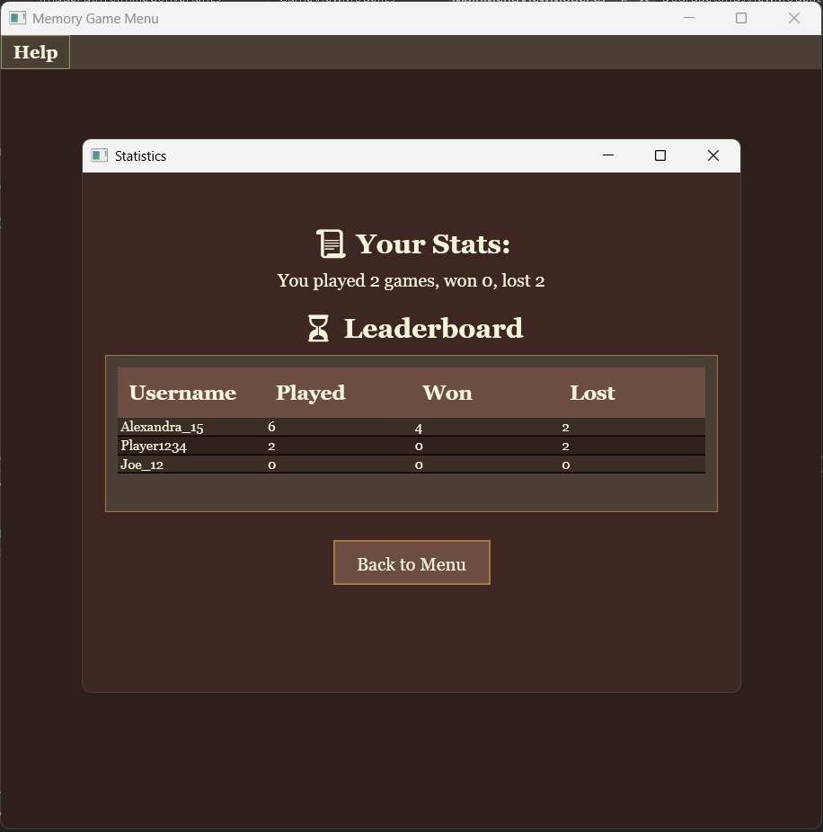
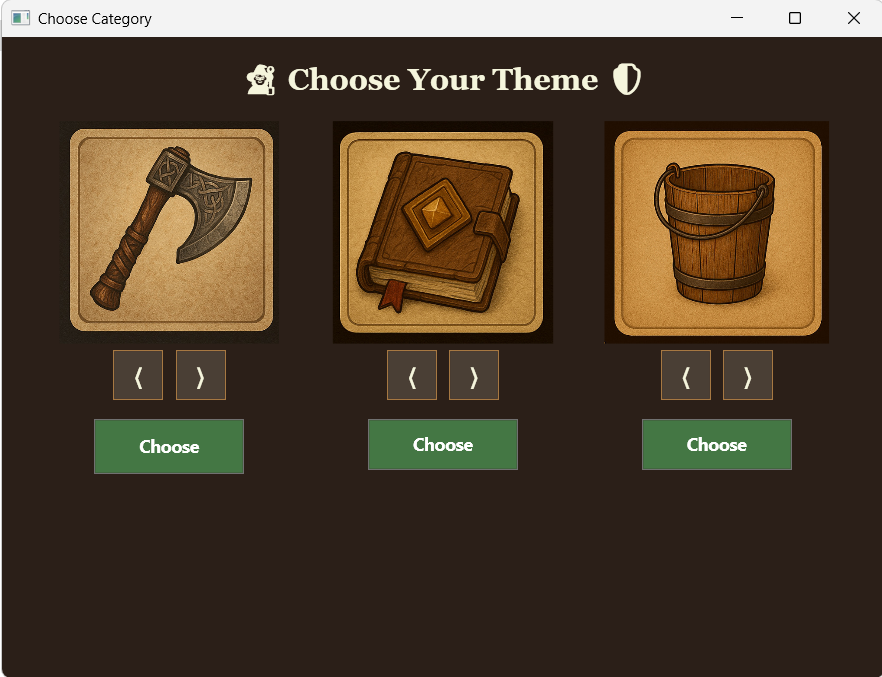

# Memory Game

Memory game is a match pairs game, developed in C# using the MVVM design pattern. The player must discover pairs of identical cards on a customizable game board, against time.

## Features

- **MVVM Architecture**: This project follows the Model-View-ViewModel (MVVM) pattern, providing a clean separation between the user interface (View) and the underlying logic (ViewModel and Model).
- **Multiple Difficulty Levels**: customize the game board (size and time limit) for a personalized experience
- **Timer-based Gameplay**
- **Leaderboard** with all registered players
- **User Profiles and Stats**: each player has a unique profile with statistics such as total games played, won, and lost

## Game Rules

1. Before starting the game, a player profile must be created. If a profile has not been created yet, navigate to the Create User section to set up a new player, including providing a username and selecting an avatar.
2. After creating a player, access the Main Menu. From the Main Menu, the following options are available:

   - Start a New Game: Begin a new game by selecting a preferred difficulty (board size) and setting a time limit

   - Load Saved Game: Continue a previously saved game

   - View Stats: View statistics on games played, won, and lost

   - Choose Category: Select a category for the images to be used in the game (Vikings, Wizards, Farmers)

   - Customize Board Size & Time: Adjust the board size (4x4, 2x4, 2x2) and set the time limit for the game
3. Game Start: Once the player selects the desired settings, the game will begin.
4. Gameplay: During the game, cards are flipped two at a time. If the two cards match, they remain face up; if not, they flip back over after a brief moment.
5. Time Limit: The game is time-limited. The timer will count down as the player attempts to match all pairs of cards within the allotted time.
6. Win Condition: The player wins by matching all cards before the timer expires.
7. Leaderboard: After the game is completed, players can view their stats and compare their performance to other users on the Leaderboard.

## Technologies Used

- C#: The primary programming language used for the game logic and application structure
- WPF: Used for building the graphical user interface (GUI)
- MVVM (Model-View-ViewModel): The architectural pattern implemented to separate the UI (View), game logic (ViewModel), and data (Model)
- XAML: Used for defining the layout and appearance of the user interface in a declarative manner
- JSON: For storing and loading user data and game progress (saved games, leaderboard)

## Screenshots

### Game in Progress

The screenshot above shows the **Game in Progress**. The player flips cards to match pairs, and the game is time-limited

### Player Stats

This screenshot shows the **Leaderboard** with stats of all players, including games played, games won, and games lost

### Category Selection

In this screenshot, the user selects the **category** for the game, which changes the images used during the game (Vikings, Wizards, Farmers)